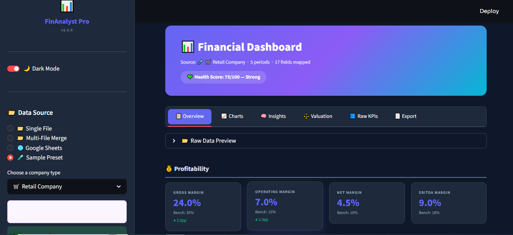
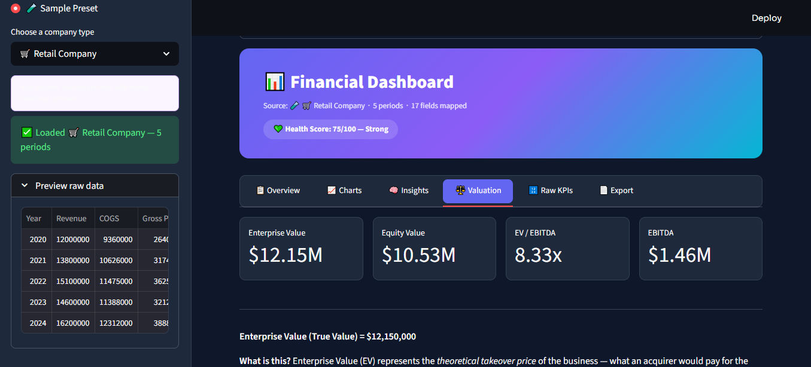

# FinAnalyst Pro

AI-powered financial analysis application.


---

## 🎯 Purpose
Automatically analyze financial data and generate key insights, KPIs, and valuations — no manual mapping required.

---

## ✨ Features

- ✅ 20+ financial KPIs (Gross Margin, EBITDA, ROE, ROA, etc.)
- ✅ True Value (Enterprise Value) – the "elite" valuation metric
- ✅ Intelligent trend detection & insights
- ✅ Interactive charts (Plotly)
- ✅ PDF report export
- ✅ Dark / light mode

---

## 🛠️ Tech Stack

- **Python** 3.9  
- **Streamlit**  
- **Pandas**  
- **Plotly**  
- **Claude (AI assistant)**

---

## 📸 Screenshots

### Main Dashboard


### KPI Analysis View


---

## 📬 Connect with me

[](https://linkedin.com/in/othmane-afif-a846713b0)

## 🚀 Installation

```bash
git clone https://github.com/ton-nom-utilisateur/FinAnalyst-Pro.git
cd FinAnalyst-Pro
pip install -r requirements.txt
streamlit run app.py
